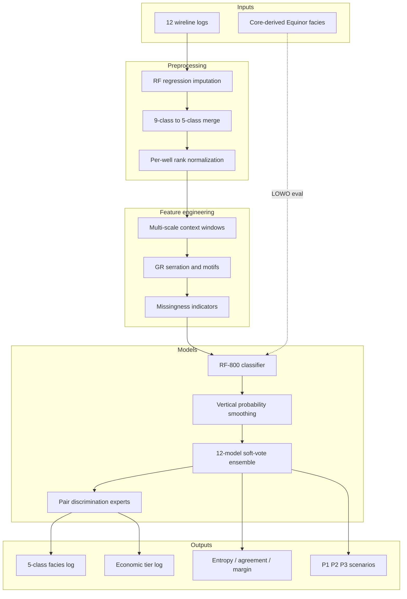

# Well Log Facies Prediction (Volve Hugin)

**Machine-learning pipeline for depositional facies classification, reservoir-tier mapping, and uncertainty-aware geomodel conditioning** — built on Equinor Volve well logs and a Kieft et al. (2011) shallow-marine facies framework.

A single Jupyter notebook runs the full stack: geostatistical EDA, leakage-safe feature engineering, ensemble classification, scenario generation, and pair-specialist re-weighting. No external scripts required.

---

## Technology stack

| Layer | Tools & libraries |
|---|---|
| **Language & runtime** | Python 3.10+, Jupyter Notebook / JupyterLab |
| **Data & numerics** | pandas, NumPy, SciPy, openpyxl (Excel I/O) |
| **Machine learning** | scikit-learn — `RandomForestClassifier`, `RandomForestRegressor`, `Pipeline`, `GroupKFold`, `LeaveOneGroupOut`, `cross_val_predict` |
| **Signal processing** | SciPy (`savgol_filter`, `find_peaks`) for log-shape and vertical smoothing |
| **Visualization** | Matplotlib |
| **Parallelism** | joblib (multi-core forest training) |

---

## Methods at a glance

*What makes this more than “fit a classifier on logs”:*

### Geoscience-informed design
- **Kieft-based facies architecture** — predictions tied to a published Hugin depositional model, not unsupervised clusters
- **Facies interval thickness & CV analysis** — bed-scale heterogeneity quantified before any modelling
- **Vertical semivariograms** (nugget, sill, range) — log decorrelation and facies-indicator ranges used to *justify* multi-scale feature windows (~1.4 m / 7 m / 23 m)
- **Per-pair ROC-AUC screening** — each confused facies pair mapped to its best log motif discriminator

### Leakage-safe ML pipeline
- **Leave-one-well-out (LOWO) evaluation** — `GroupKFold` / well-grouped holdout; simulates blind deployment on unseen boreholes
- **~117 engineered features** from 12 wireline curves: per-well **rank normalization**, missingness flags, multi-scale rolling context, GR serration / fining-up motifs, relative stratigraphic position
- **Nested normalization selection** — rank vs z-score chosen per fold on training wells only; validated with **McNemar paired test** (p ≈ 10⁻⁵)
- **Random Forest classifier** — 800 trees, depth 25, `class_weight='balanced'`; beat gradient-boosting alternatives (HGB, LightGBM, XGBoost) in blind tests
- **sklearn `Pipeline`** — median imputation → forest; fold-constant columns dropped automatically
- **Vertical probability smoothing** — depth-consistent class posteriors before argmax (window optimised by sweep)

### Uncertainty & scenarios
- **12-model soft-voting ensemble** — 6 feature *views* × 2 tuning objectives; equal-weight probability fusion
- **Per-sample uncertainty signals** — prediction entropy, inter-model agreement %, top-1 − top-2 margin
- **P1 / P2 / P3 scenario realizations** — alternative facies columns for stochastic geomodel conditioning (proportions, bed thickness, transition matrices)
- **Discrimination experts (Step 11)** — pair-aware re-weighting of ensemble views where confusion persists (Tidal Bar ↔ Mouthbar)

### Supporting ML subsystems
- **Regression imputation** — `RandomForestRegressor` (300 trees) fills F-14 missing PHIF/SW with `LeaveOneGroupOut` quality checks
- **Learning curves** — blind accuracy vs number of training wells (1 → 4)
- **Confusion matrices** — facies (5-class) and economic tier (Excellent / Good / Seal)
- **Appendix ablations** — baseline feature sets, physics-based imputation, smoothing sweep, seal-threshold tuning

---

## Pipeline architecture



---

## Repository contents

| File | Description |
|---|---|
| `main_workflow_v3.ipynb` | End-to-end workflow (Steps 0–11 + appendix) |
| `Dataset_logs_core_v4_cleaned.xlsx` | Volve well logs (~0.15 m sampling, 19 wells) |
| `requirements.txt` | Pinned scientific stack + Jupyter |

---

## Problem

Core-derived facies labels are authoritative but sparse. Wireline logs are continuous yet ambiguous at a single depth — GR, porosity, and shale indicators overlap between tidal bars, mouth bars, and heterolithic packages. This workflow infers **5-class facies** and **economic tiers** (pay vs seal) along the full borehole, including in blind wells not used for training.

---

## Headline results (pooled blind wells)

| Metric | Value |
|---|---|
| Facies accuracy | ~0.58 |
| Tier accuracy | ~0.65 |
| Macro-F1 | ~0.50 |
| Pay vs seal accuracy | ~0.96 |
| Reservoir recall (pay captured) | ~0.99 |
| Within-1-tier accuracy | ~0.98 |

---

## Quick start

```bash
git clone https://github.com/artem-potlog/well-log-facies-prediction.git
cd well-log-facies-prediction
pip install -r requirements.txt
jupyter notebook main_workflow_v3.ipynb
```

Run all cells top to bottom. The notebook locates `Dataset_logs_core_v4_cleaned.xlsx` automatically from the workspace root.

---

## Workflow steps

| Step | What happens |
|---|---|
| **0** | Problem statement, geological motivation, blind-well protocol |
| **1–2** | Load data, availability audit, RF imputation for F-14 |
| **3** | Merge 9 Equinor classes → 5 decision classes + economic tiers |
| **3a** | Thickness distributions, CV, semivariograms |
| **4** | ~117 leakage-safe features (rank norm, multi-scale context, motifs) |
| **4b** | Per-class violins, per-pair AUC table |
| **5–7** | RF-800 + smoothing, LOWO evaluation, pooled metrics |
| **8** | Confusion matrices, feature importance, learning curve |
| **9** | 12-model ensemble + per-well input/output panels |
| **10–10a** | P1/P2/P3 scenarios as depositional architectures |
| **11** | Pair-aware discrimination expert re-weighting |
| **Appendix** | Side experiments and rejected alternatives |

---

## References

Facies scheme grounded in **Kieft et al. (2011)** — shallow-marine, tide-influenced Hugin deposition. Full citations in the notebook References section.
